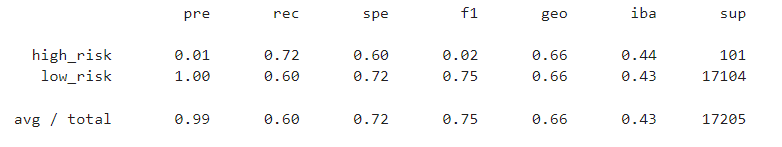
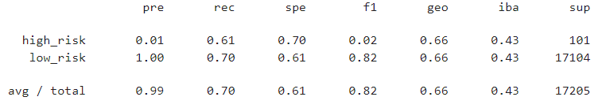
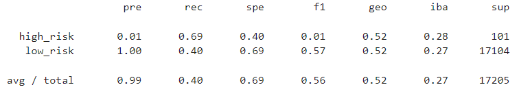
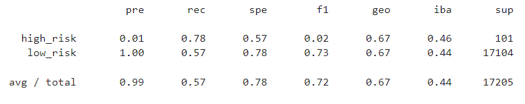
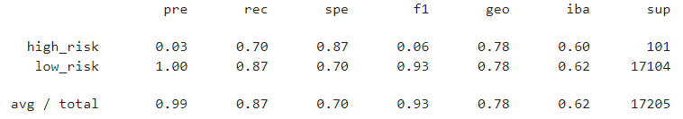
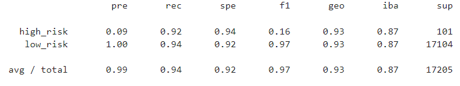

# Credit Risk Analysis
Supervised ML evaluation of credit risk data

## Purpose
This analysis uses machine learning to train a model to predict high risk credit loans. The number of low risk loans in the dataset far outweigh the number of high risk loans. Therefore, the imblanced learn library was used to deal with this asymmetry. 
  
## Methods
Several algorithms were used in order to determine the best performance for the model. In particular, resampling and ensemble techniques were used.
### Resampling
Oversampling from the high risk cases using <b>RandomOverSampler</b> and <b>SMOTE</b> algorithms were used to balance the number of cases being analyzed. The <b>ClusterCentroids</b> algorithm was used to undersample the low risk cases for the same purpose. Additionally, a combination of oversampling and undersampling, <b>SMOTEENN</b> was used to balance the inputs.
###Ensemble Classifiers
The <b>BalancedRandomForestClassifier</b> and <b>AdaBoost</b> algorithms were used to employ decision tree techniques to produce a more robust and accurate model.
  
## Analysis
The recall score will provide the best indicator of the number of high risk cases that are caught. Using this figure may label some low risk cases as high risk, but a higher recall score ensures that the highest number of high risk cases are identified.
  
<b>Native Random Oversampling</b>
 
High risk recall score of 0.72  
<b>SMOTE Oversampling</b>
 
High risk recall score of 0.61  
<b>Cluster Centroids Undersampling</b>
 
High risk recall score of 0.69  
<b>SMOTEENN Combination Sampling</b>
 
High risk recall score of 0.78  
<b>Balanced Random Forest Classifier</b>
 
High risk recall score of 0.70  
<b>Easy Ensemble AdaBoost Classifier</b>
 
High risk recall score of 0.92 
  
## Recommendation
The Easy Ensemble AdaBoost Classifier algorithm is the obvious choice, because it correctly identified 92% of the fraudulent cases.